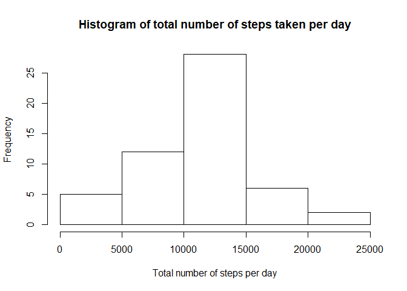
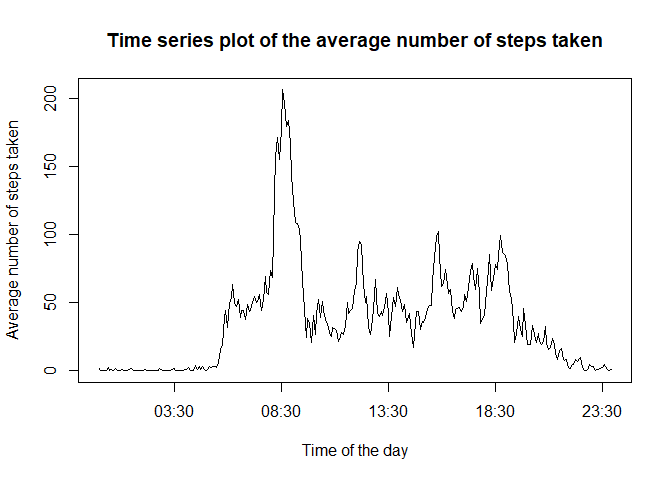
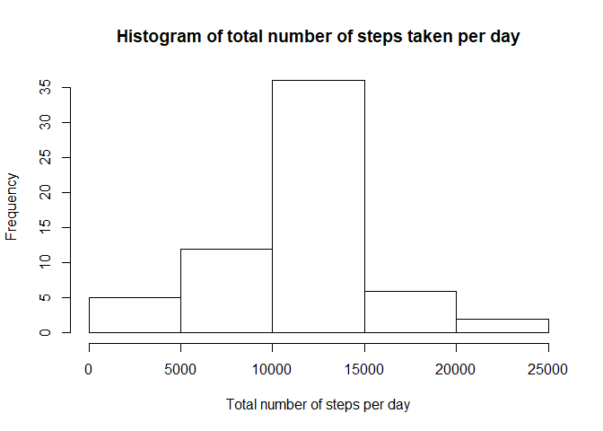
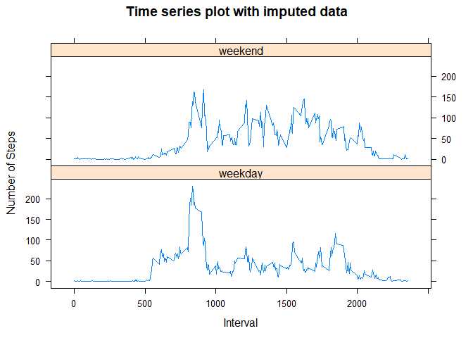

## Loading and preprocessing the data

#### Load the data


```r
df <- read.csv(unz("activity.zip","activity.csv"), header = TRUE, sep = ",")
```

#### Process/transform the data: Create two new columns, one for date and one for time. Both these columns belong to the POSIXct class


```r
df[,"date_formatted"] <- with(df, as.POSIXct(date, format = "%Y-%m-%d"))
df[,"time_formatted"] <- with(df, as.POSIXct(paste(floor(interval/100), interval %% 100, sep = ":"), format = "%H:%M"))
```

## What is mean total number of steps taken per day?

#### Histogram of the total number of steps taken each day


```r
daily_steps <- aggregate(steps~date_formatted,data = df, sum)
hist(daily_steps$steps, main = "Histogram of total number of steps taken per day", xlab = "Total number of steps per day", ylab = "Frequency")
```

<!-- -->

The **mean** and **median** total number of steps taken per day


```r
mn <- mean(daily_steps$steps)
mdn <- median(daily_steps$steps)
```

The **mean** of total number of steps taken per day is 1.0766189\times 10^{4}.
The **median** of total number of steps taken per day is 10765.

## What is the average daily activity pattern?

#### Time series plot (i.e. `type = "l"`) of the 5-minute interval (x-axis) and the average number of steps taken, averaged across all days (y-axis)


```r
time_series <- aggregate(steps~time_formatted+interval,data = df, mean)
plot(time_series$time_formatted,time_series$steps,type="l", main = "Time series plot of the average number of steps taken", xlab = "Time of the day", ylab = "Average number of steps taken")
```

<!-- -->

#### 5-minute interval that, on average across all the days in the dataset, contains the maximum number of steps


```r
time_max <- format(time_series[which.max(time_series$steps),1], "%H:%M")
time_max_interval <- time_series[which.max(time_series$steps),2]
```

The 5-minute interval having maximum average number of steps is 835. This is the same as 08:35.

## Imputing missing values

#### The total number of missing values in the dataset


```r
no_of_NAs <- sum(is.na(df$steps))
```

Total number of missing values are 2304

#### Strategy for filling in all of the missing values in the dataset is simply to fill the mean for that 5-minute interval.

#### New dataset that is equal to the original dataset but with the missing data filled in.


```r
df_imputed <- df
for(i in 1:nrow(time_series)){
  df_imputed[which(is.na(df$steps) & df$time_formatted == time_series[i,1]), "steps"] <- time_series[i,"steps"]
}
```

#### Histogram of the total number of steps taken each day


```r
daily_steps_imputed <- aggregate(steps~date_formatted,data = df_imputed, sum)
hist(daily_steps_imputed$steps, main = "Histogram of total number of steps taken per day", xlab = "Total number of steps per day", ylab = "Frequency")
```

<!-- -->

#### The **mean** and **median** total number of steps taken per day


```r
mn_imputed <- mean(daily_steps_imputed$steps)
mdn_imputed <- median(daily_steps_imputed$steps)
```

The **mean** of total number of steps taken per day is 1.0766189\times 10^{4}.
The **median** of total number of steps taken per day is 1.0766189\times 10^{4}.

Only the **median** changes from the first part of the assignment from 10765 to 1.0766189\times 10^{4}. The **mean** remains same as `mn`.

Impact of imputing missing data on the estimates of the total daily number of steps is not signficant as the mean remains same in both cases.

## Are there differences in activity patterns between weekdays and weekends?

#### New factor variable in the dataset with two levels -- "weekday" and "weekend" indicating whether a given date is a weekday or weekend day.


```r
df_imputed[,"day_type"] <- "weekday"
df_imputed[which(weekdays(df_imputed$date_formatted) %in% c("Saturday","Sunday")),"day_type"] <- "weekend"
df_imputed$day_type <- as.factor(df_imputed$day_type)
```

#### Panel plot containing a time series plot (i.e. `type = "l"`) of the 5-minute interval (x-axis) and the average number of steps taken, averaged across all weekday days or weekend days (y-axis)


```r
time_series_imputed <- aggregate(steps~interval+day_type,data = df_imputed, mean)
library(lattice)
xyplot(steps~interval|day_type,data = time_series_imputed,layout = c(1,2), type = "l", main = "Time series plot with imputed data", xlab = "Interval", ylab = "Number of Steps")
```

<!-- -->

The difference in activity pattern between weekdays and weekends is that on weekends the number of steps is evenly spread throughout the day while on weekdays there's a noticeable peak at 08:30 hours.
